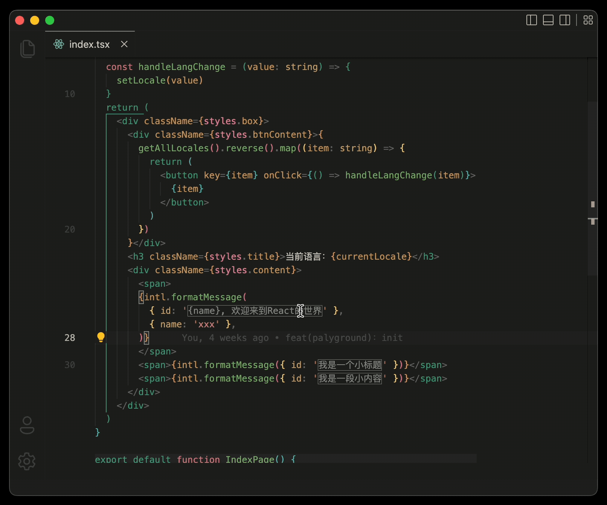

<em>Umi Intl for VS Code</em>
<h1 align="center">
  
</h1>

## 简介

> 一个针对于 umi 国际化的 VS Code 辅助提示插件

## 效果

<h2 align="center">
  
</h2>
## 注意

> 目前仅支持：`formatMessage({ id: 'xxx' })`

## TODOs

- [ ] 修复已知 bugs
- [ ] 添加 umirc 检测
- [ ] React Intl API 支持健全
- [ ] 实时更改更新（待定）

## 灵感

> 灵感来源：[ i18n Ally](https://marketplace.visualstudio.com/items?itemName=Lokalise.i18n-ally)
> `i18n Ally` 对于 `umi` 是不支持的。因为 umi 内置了 `react intl` 插件，所以准确的避开了 `i18n Ally` 的匹配规则。但是这个功能我感觉非常好玩且有用，所以就参照 `i18n Ally` 中我想要的功能开发了一下。

